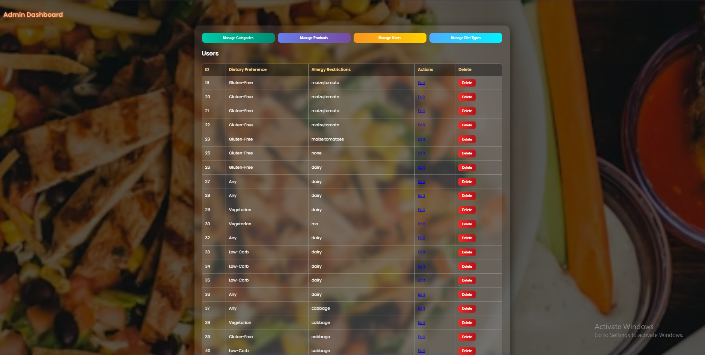
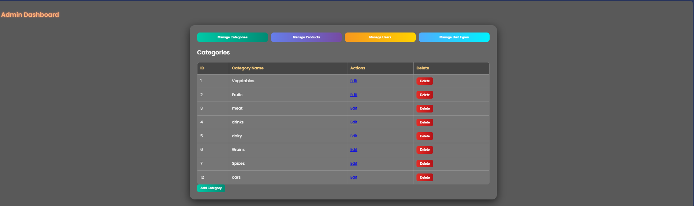
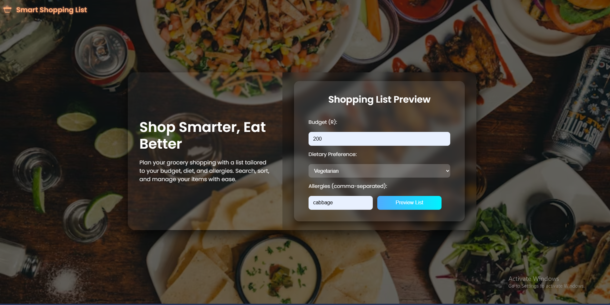
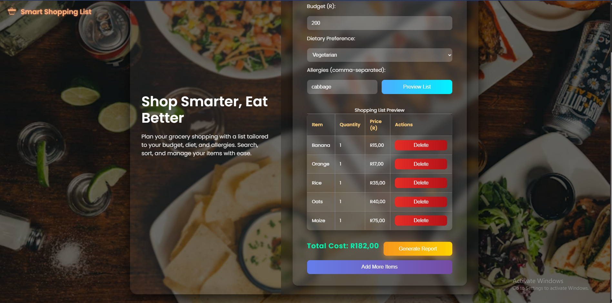
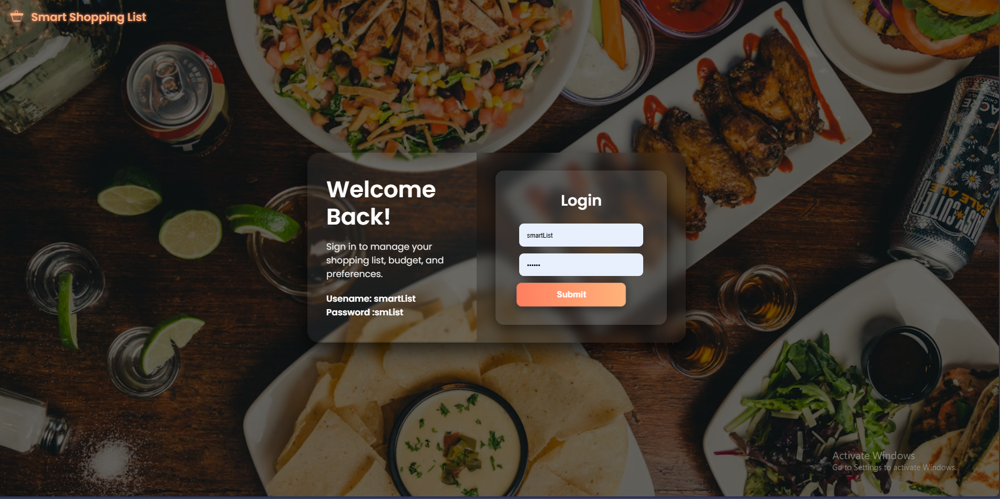
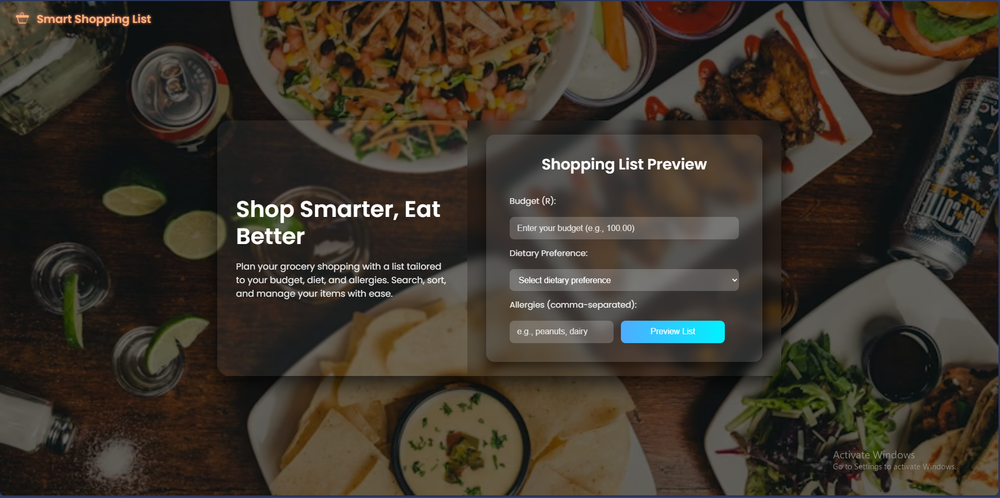
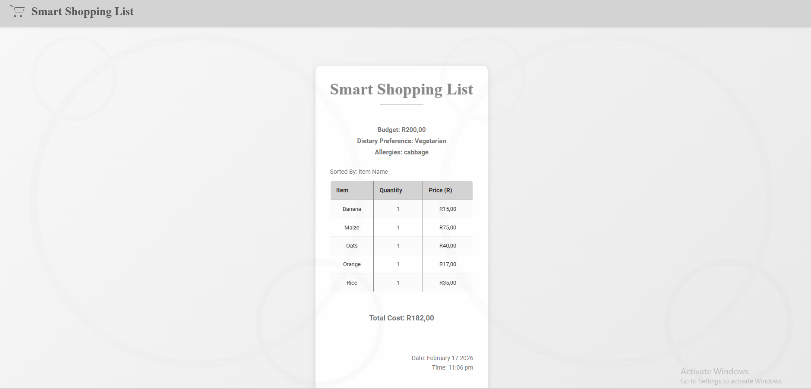

🛒 SmartGenList

SmartGenList is a web-based application built with ASP.NET and SQL Server that helps users generate personalized shopping lists based on dietary preferences, budget, and allergies. The app also includes an admin panel for managing items, making it a complete solution for dietary-conscious shopping.

🌟 Features
User Features

Login: Secure authentication with provided credentials.

Personalized Shopping Lists: Generate lists based on:

Dietary preferences (e.g., vegetarian, vegan, keto)

Budget constraints

Allergies (e.g., nuts, gluten, lactose)

Reports: Automatically generate detailed reports of shopping lists, including cost breakdown and dietary compliance.

Admin Features

Add new items to the database.

Edit or delete existing items.

Manage item categories and stock (optional).

View all generated shopping lists (optional).

🏗️ Architecture
Users/Admin
    │
    ▼
ASP.NET Web Application (Web Forms)
    │
    ▼
SQL Server Database (local)

Frontend: ASP.NET Web Forms providing web-based UI for users and admins.

Backend: SQL Server storing user credentials, items, and shopping list data.

Reports: Generated dynamically in the application.

💻 Getting Started
Prerequisites

Windows OS

Visual Studio (2019 or later)

.NET Framework (matching project version)

SQL Server (local instance)

Browser (Chrome, Edge, Firefox, etc.)

Installation

Clone or download the repository.

Open the solution in Visual Studio.

Ensure SQL Server is running and the database is attached.

Update the connection string in Web.config to match your SQL Server instance.

Build and run the project using IIS Express or full IIS.

🔧 Usage
User

Open the application in a browser.

Login with your credentials.

Input dietary preferences, budget, and allergies.

Click Generate List to create your personalized shopping list.

Download or view the generated report.

Admin

Login with admin credentials.

Access the Admin Panel.

Add, edit, or delete items.

Optionally view all users’ generated lists and manage stock.

🛠️ Technologies Used

Frontend: ASP.NET Web Forms

Backend: C#

Database: SQL Server (local)

Reporting: Custom report generation (HTML/Print-ready)

📈 Future Enhancements

Export reports as PDF or Excel.

Implement hashed passwords for enhanced security.

Add user activity history (past shopping lists).

Deploy to a server for multi-user access.

Include stock alerts and notifications in admin panel.

📂 Project Structure
SmartGenList/
│
├── SmartGenList.sln            # Visual Studio solution
├── SmartGenList/               # Main web project
│   ├── Admin/                 # Admin pages (add/edit/delete items)
│   ├── Users/                 # User pages (login, list generation)
│   ├── Reports/               # Report generation logic
│   ├── App_Code/              # C# classes and utilities
│   └── Web.config             # Connection strings and app settings
└── README.md

👨‍💻 Author

Mlu Ncube – Developer

Email: ncubemlu05@gmail.com

## 📸 Application Screenshots

### Admin

### Admin Dashboard

### Info Page

### List Page

### Login Page

### Preference Page

### Report Page

